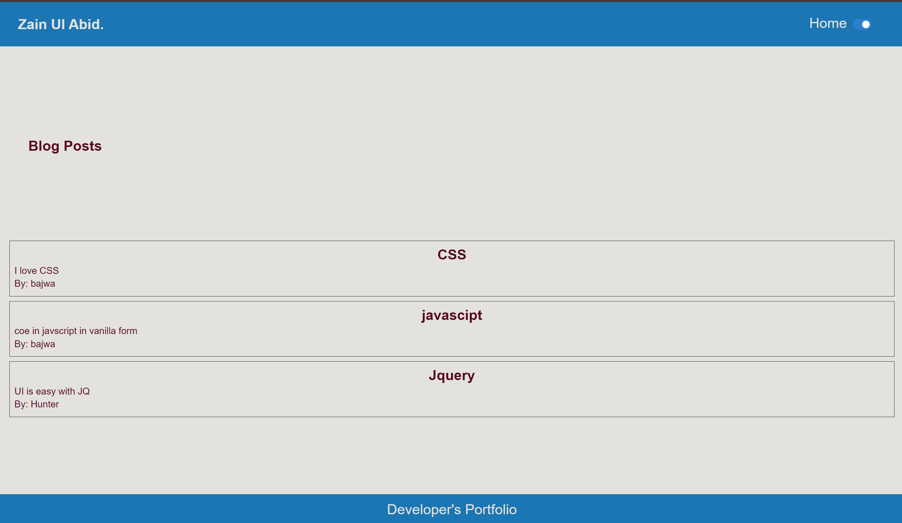

# BlogPosts Site for Developers
A site to write blogpost and store them in localstorage and displaying them in a list with a light mode and dark mode theme
# Installaiton
Not Needed

# Usage

## Deployed Link
<em><a href="https://zainabid333.github.io/zain-ul-abid-portfolio/"><strong>CLick here for Zain Ul Abid Portfolio</strong></a></em>

# Logics

## Theme Switcher
Theme switcher uses the localstorage to store the current theme and load up the stored theme on website loading 
## Blog post Writing
A form used to to input username blog title and content for blog post 
## Blog Posts
A localstorage JSON array used to store newly created blogs in localstorage and displaying them in a block section whenever new blogs are added

## Screenshot

